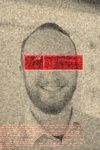

# Metal Gear Solid Patriots Image Processor

The script emulates the filter applied to the profile pictures of the patriots in Metal Gear Solid.



It uses OpenCV to locate the eyes for the red box, which is why I haven't bothered with a requirements.txt.

## Why?

This started as a joke (much like catollage). My coworkers thought it would be amusing if the employee images used the MGS patriots effect instead of simply greying out their faces. It turns out it wasn't that hard to implement.

## Installation

The following dependencies are required:

- Python (2.7.12)
- OpenCV (2.4.9)
- SciPy (0.17.0)
- NumPy (1.11.0)

Assuming Ubuntu 16.04:

```
apt install python python-opencv python-scipy python-numpy
```
